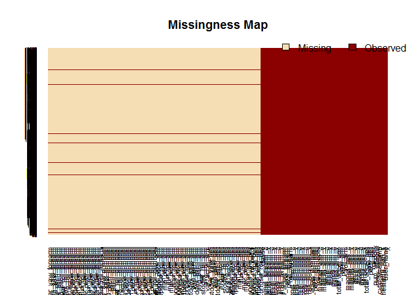
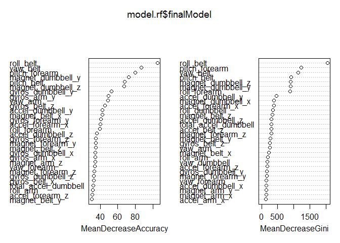

# Practical Machine Learning Assignment
Arkadiusz Oliwa  
13 April 2018  


# Introduction

Dataset Human Activity Recognition contains classes (sitting-down, standing-up, standing, walking, and sitting) collected on 8 hours of activities of 4 healthy subjects. The goal of this project is to predict the manner in which they did the exercise. The training set will be used to build machine learning models.

Install all required packages.

```r
library(caret)
library(randomForest)
library(dplyr)
library(Amelia)
library(dplyr)
library(doSNOW)
```


Load up the .CSV data

```r
training <- read.csv(file = "https://d396qusza40orc.cloudfront.net/predmachlearn/pml-training.csv", 
                     header = TRUE, na.strings=c("", "NA"))
testing <- read.csv(file = "https://d396qusza40orc.cloudfront.net/predmachlearn/pml-testing.csv", 
                    header = TRUE, na.strings=c("", "NA"))
```

# Cleaning data.

Show missing data

```r
missmap(obj = training, y.cex=0.5, x.cex=0.7)
```

<!-- -->

I used Amelia package for showing missing data imputation. Missmap draws a map of the missingness in a dataset using the image function. As you can see more than half variables have null value so I removed this columns.


```r
cols <- sapply(X = training, FUN = function(X) sum(is.na(X)) == 0)
training <- training[, cols]
```

Several variables are not directly related to the target variable. They even may lead to misleading results.  So I’m removed first seven variables such as "X", "user_name", "raw_timestamp_part_1", "raw_timestamp_part_2", "cvtd_timestamp", "new_window", "num_window"


```r
glimpse(training[,1:10])
```

```
## Observations: 19,622
## Variables: 10
## $ X                    <int> 1, 2, 3, 4, 5, 6, 7, 8, 9, 10, 11, 12, 13...
## $ user_name            <fctr> carlitos, carlitos, carlitos, carlitos, ...
## $ raw_timestamp_part_1 <int> 1323084231, 1323084231, 1323084231, 13230...
## $ raw_timestamp_part_2 <int> 788290, 808298, 820366, 120339, 196328, 3...
## $ cvtd_timestamp       <fctr> 05/12/2011 11:23, 05/12/2011 11:23, 05/1...
## $ new_window           <fctr> no, no, no, no, no, no, no, no, no, no, ...
## $ num_window           <int> 11, 11, 11, 12, 12, 12, 12, 12, 12, 12, 1...
## $ roll_belt            <dbl> 1.41, 1.41, 1.42, 1.48, 1.48, 1.45, 1.42,...
## $ pitch_belt           <dbl> 8.07, 8.07, 8.07, 8.05, 8.07, 8.06, 8.09,...
## $ yaw_belt             <dbl> -94.4, -94.4, -94.4, -94.4, -94.4, -94.4,...
```

```r
training <- training[,-c(1:7)]
```

# Model training

I leverage function makeCluster  in order to parallel computing.  The reason is: by making the computer work harder (perform many calculations simultaneously) we wait less time for building model. The following code is configured to run on a workstation containing 3 logical cores.


```r
cl <- makeCluster(3, type="SOCK")
registerDoSNOW(cl)
```


```r
set.seed(123)
```

Then I created the training control object. In this assignment was applied 3-folds cross-validation in order to avoid overfitting


```r
train_control <- trainControl(method = "cv", number = 3, 
                              allowParallel = TRUE, verboseIter = TRUE)
```

In this assignment I used a random forest model. Random forests is a popular ensemble method that can be used to build predictive models for both classification and regression problems. In this case target variable is "classe" (A - sitting-down, B - standing-up, C- standing, D - walking, and E- sitting)

```r
model.rf <- train(classe ~ ., data = training,
                  method = "rf",
                  importance = TRUE,
                  trControl = train_control)
```

```
## Aggregating results
## Selecting tuning parameters
## Fitting mtry = 27 on full training set
```

stopCluster is called to properly shut down the cluster before exiting R. If it is not called it may be necessary to use external means to ensure that all slave processes are shut down


```r
stopCluster(cl)
```

**Summary of the training: **


*Model based on random forest has good results over the training set. This model has accuracy approximately 99%


```r
model.rf
```

```
## Random Forest 
## 
## 19622 samples
##    52 predictor
##     5 classes: 'A', 'B', 'C', 'D', 'E' 
## 
## No pre-processing
## Resampling: Cross-Validated (3 fold) 
## Summary of sample sizes: 13081, 13082, 13081 
## Resampling results across tuning parameters:
## 
##   mtry  Accuracy   Kappa    
##    2    0.9929163  0.9910390
##   27    0.9932220  0.9914255
##   52    0.9869027  0.9834305
## 
## Accuracy was used to select the optimal model using  the largest value.
## The final value used for the model was mtry = 27.
```

**Variance Importance Plot**


* MeanDecreaseAccuracy : roll_belt > pitch_forearm > yaw_belt Important parameters for accuracy improvement are determined by the “MeanDecreaseAccuracy”.
* MeanDecreaseGini : roll_belt > yaw_belt > pitch_forearm Important parameters for improving node impurities are determined by the “MeanDecreaseGini”.


```r
varImpPlot(model.rf$finalModel)
```

<!-- -->

# Prediction for test dataset
Them main goal of this project was predict the manner in which subjects did the exercise, so below is result:

```r
predict(object = model.rf, newdata = testing)
```

```
##  [1] B A B A A E D B A A B C B A E E A B B B
## Levels: A B C D E
```


